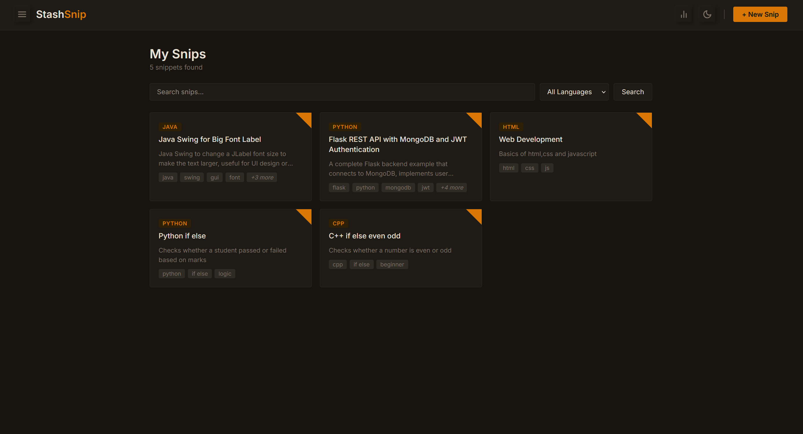
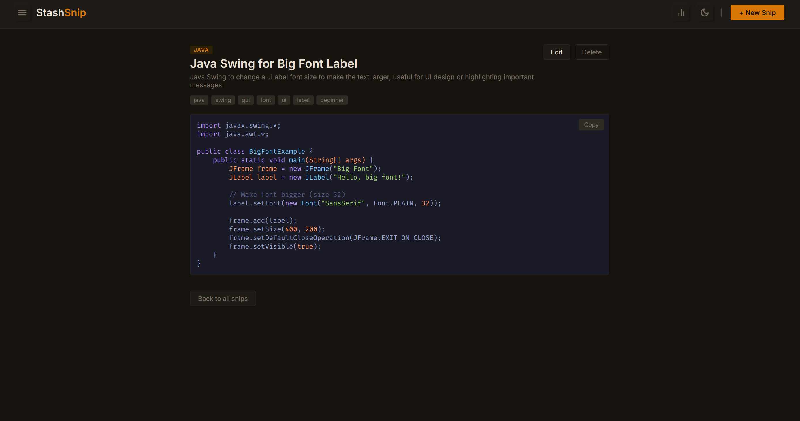
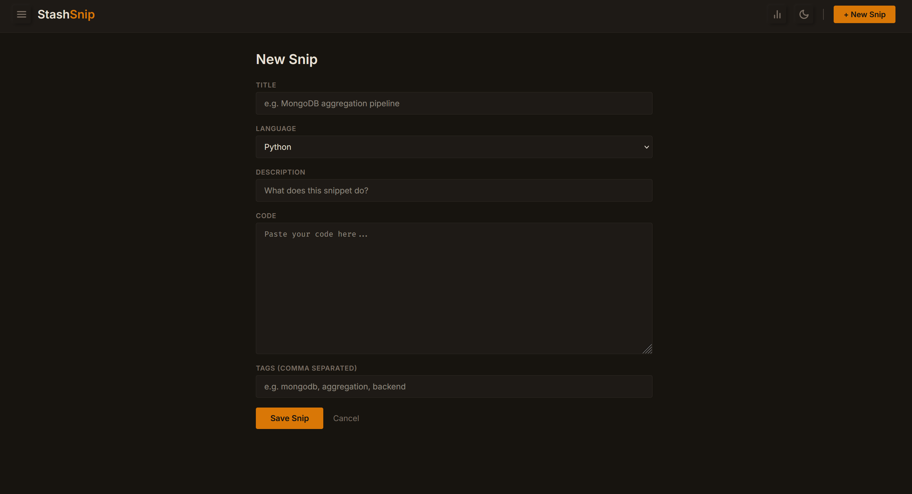
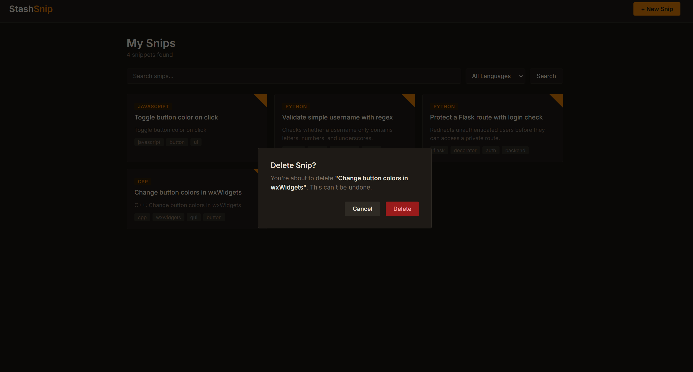

# StashSnip

> I stash my snips! A developer snippet manager built to save, organize and find code fast.


---

## Table of Contents

- [The Problem](#the-problem)
- [Features](#features)
- [Tech Stack](#tech-stack)
- [Project Structure](#project-structure)
- [Interface](#interface)
- [Live Demo](#live-demo)
- [Getting Started](#getting-started)
- [Environment Variables](#environment-variables)
- [Testing](#testing)
- [Contributing](#contributing)
- [Contributors](#contributors)
- [License](#license)

---

## The Problem

Every developer accumulates dozens of useful code snippets. A regex that finally worked, a MongoDB aggregation pipeline, a Flask decorator you keep rewriting from scratch. They end up scattered across Notion pages, random `.txt` files and old Stack Overflow tabs.

**StashSnip** keeps them in one place tagged, searchable and always one click away.

---

## Features

- Save snippets with title, language, description and tags
- Full-text search across title and description
- Filter by language or tag
- Pagination, so the grid stays fast as your stash grows
- Syntax highlighting via highlight.js
- Copy to clipboard in one click, from the snippet detail page or straight from the card grid
- Edit and delete snippets, with a custom delete modal and name confirmation
- Stats dashboard: snippet counts by language, top tags, oldest/newest snippet
- Auto-dismissing flash messages

---

## Tech Stack

| Layer | Technology |
|---|---|
| Backend | Python, Flask (app factory pattern + Blueprints) |
| Database | MongoDB Atlas + PyMongo |
| Frontend | HTML, CSS, Vanilla JS — no framework |
| Forms | Flask-WTF |
| Syntax Highlighting | highlight.js |
| Testing | pytest |
| Version Control | Git + GitHub |

---

## Project Structure

```
StashSnip/
├── app/
│   ├── __init__.py        # App factory
│   ├── routes.py          # Blueprint: all view routes
│   ├── models.py          # Snippet document schema
│   ├── db.py              # MongoDB connection
│   ├── forms.py           # Flask-WTF forms
│   ├── utils.py           # Small helpers (tag parsing, etc.)
│   ├── static/
│   │   ├── style.css
│   │   └── main.js
│   └── templates/
├── tests/                 # pytest test suite
├── docs/screenshots/
├── config.py
├── run.py                 # Entry point
└── requirements.txt
```

The app follows Flask's application factory pattern with a single Blueprint for routes, which keeps `create_app()` in `__init__.py` free of side effects and makes the app easy to test in isolation (see `tests/`).

---

## Interface






---

## Live Demo

**[https://stash-snip.up.railway.app/](https://stash-snip.up.railway.app/)**

> ! Hosted on Railway's free tier.
> If the app is asleep or gone, you know the credits ran out.

Then follow the 5 minute rule!

> Clone it and run it locally, it takes less then 5 minutes!

Feel free to add a snippet, poke around, break something.

---

## Getting Started

### Prerequisites

- Python 3.11+
- MongoDB Atlas account

### Setup

```bash
# Clone the repo
git clone https://github.com/byteofhoney/StashSnip.git
cd StashSnip

# Create virtual environment
python -m venv venv
venv\Scripts\activate  # Windows
source venv/bin/activate  # Mac/Linux

# Install dependencies
pip install -r requirements.txt

# Set up environment variables
cp .env.example .env
# Edit .env with your MongoDB URI and secret key

# Run the app
python run.py
```

Visit `http://127.0.0.1:5000`

---

## Environment Variables

| Variable | Description |
|---|---|
| `MONGO_URI` | Your MongoDB Atlas connection string |
| `SECRET_KEY` | Flask secret key for session security |
| `FLASK_ENV` | `development` or `production` |

---

## Testing

The project uses `pytest` for route-level testing.

```bash
pytest
```

Tests cover the home, add, edit and 404 routes, along with pagination and filter behavior. Contributions that add coverage for new routes are always welcome.

---

## Contributing

StashSnip is open to contributions of all sizes from fixing a typo to picking up a feature from the open issues.

- Check [CONTRIBUTING.md](CONTRIBUTING.md) for setup, branch naming, and PR guidelines
- Browse [open issues](../../issues) — issues labeled `good first issue` are a solid place to start
- Please open an issue before starting work on anything not already tracked, so we can align on approach first

---

## Contributors

Thanks to everyone who has contributed to StashSnip 

<a href="https://github.com/AdvaitVarhade"></a>
<a href="https://github.com/pollychen-lab"></a>

---

## License

MIT — see [LICENSE](LICENSE)

---
